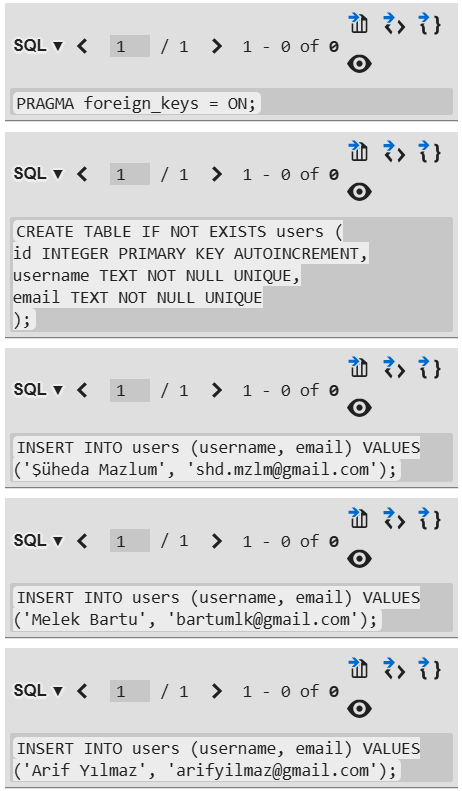
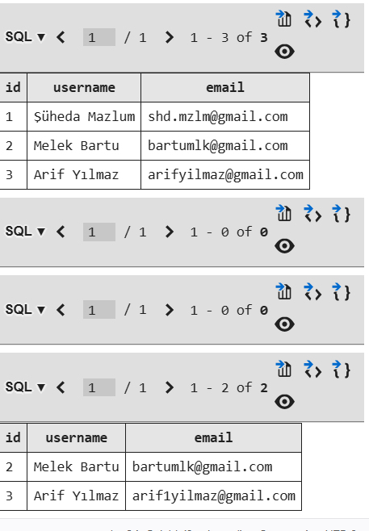

# 16 Eylül Ödevi 
## S1 - SQL CRUD
```sql 
PRAGMA foreign_keys = ON;

CREATE TABLE IF NOT EXISTS users (
    id INTEGER PRIMARY KEY AUTOINCREMENT,
    username TEXT NOT NULL UNIQUE,
    email TEXT NOT NULL UNIQUE
);

INSERT INTO users (username, email) VALUES ('Şüheda Mazlum', 'shd.mzlm@gmail.com');
INSERT INTO users (username, email) VALUES ('Melek Bartu', 'bartumlk@gmail.com');
INSERT INTO users (username, email) VALUES ('Arif Yılmaz', 'arifyilmaz@gmail.com');

SELECT * FROM users;

UPDATE users SET email = 'arif1yilmaz@gmail.com' WHERE id = 3;

DELETE FROM users WHERE id = 1; 

SELECT * FROM users;
```



```text
 verilen görsellerde sırası ile
*users tablosu oluşturulmuştur
CREATE TABLE : tablo oluşturma komutu
*tabloya 3 veri eklenmiştir.
INSERT INTO : veri ekleme komutu
*tablodaki veriler listelenmiştir
SELECT * FROM : verileri listeleme komutudur. id vb. veriyi belirterek sadece istediğimiz kullanıcıyı da yazdırabiliriz.
*3. verinin mail adresi güncellenmiştir
UPDATE : verileri güncelleyen komut
*1. veri veritabanından silinmiştiir
DELETE:veri silen komuttur
*değişikliklerden sonra tablodaki veriler tekrar yansıtılmıştır
```
## S2 - INNER-JOIN

```sql
PRAGMA foreign_keys = ON;

CREATE TABLE IF NOT EXISTS users (
    id INTEGER PRIMARY KEY AUTOINCREMENT,
    username TEXT NOT NULL UNIQUE,
    email TEXT NOT NULL UNIQUE
);

CREATE TABLE IF NOT EXISTS orders (
    id INTEGER PRIMARY KEY AUTOINCREMENT,
    user_id INTEGER NOT NULL,
    order_id INTEGER NOT NULL,
    FOREIGN KEY (user_id) REFERENCES users(id)
);
     
SELECT * FROM users INNER JOIN orders ON users.id = orders.user_id;
```
```text
yukarıdaki kod bloğunda users ve orders tabloları oluşturulmuştur.
bu tablodaki user_id gibi ortak veri kullanarak tabloları birleştirdik gibi düşünebiliriz. INNER JOIN komutu tabloların birleşmesini sağlayan komuttur
```
## S3 - MOBİL UYGULAMA GÜVENLİĞİ
### Ekran Görüntüsü ve Ekran Kaydı
```text
Bİr bankacılık uygulamasında gizli kalması gereken bilgiler gösterilirken ekran kaydını önlemek olası siber saldırılara karşı kullanıcıların bilgi gizliliğini korur.Uygulamanın güvenilirliği ve kullanıcı mağduriyetini önlemek için önemlidir.
```
```sql

// android :

window.setFlags{
    windowManager.LayoutParams.FLAG_SECURE
    windowManager.LayoutParams.FLAG_SECURE
}
// windows yanlışıkla yazmış olma durumuna karşı iki kere yazdırarak emin olur

setContentView(R.Layout.activity_main)
```

```swift
// ios :

// iosta kodun son kısmı

import UIKit

kjreoıeu
fkeıjoıe
lgmokjf

private func checkScreenRecord(){   
    if(UIScreen.main.isCaptured){
        print("UYARI! cihazda ekran kaydı açık")
    }
}
```

### Overlay Saldırıları
```text
Türkçede oltalama olarak geçen bu siber saldırı türünde kullanıcının gördüğü ekranda oyun için ödül,fener yakma, duvar kağıdı seçme gibi buton bulunmaktadır.Bu ekranın arka planında ise bankadan havale için onay işlemi gibi dolandırıcılık dönmektedir.
```

### Root/Jailbreak
```text
Androidde root, iosta jailbreak dediğimiz sistem yöneticisinin yetkilerinin açılmasıdır.Yani veriler korumasızlaşır ve saldırgan normal bir cihaza kıyasla daha yüksek yetkilerle çoğu hatta tüm verilere ulaşabilir.
```

### SQLite & Şifreleme
```text
SQLite veritabanındaki veriler şifrelenmez.Bu da tüm verilerin ulaşılabilir olması demektir. 

SQLCipher her bir veriyi 256 bitlik şifreler kullanarak şifreler ve bu şifrelerin anahtarı olmadan veriye ulaşılamaz.
```

### Access Token & Refresf Token
```text
Bir uygulama veya siteye giriş yapıldığında kullanıcı bilgileri kayıt altına alınır ve access token, refresh token elde edilir.Access token ile api çağrısı yapılır ve kısa sürelidir (Genelde 15 dk) ve süresi dolduğunda (401error) kullanıcıdan tekrar giriş istenmeden refresh token ile yeni access token üretilir.Refresh token ele geçirildiğinde saldırganlar tarafınan sürekli yeni access tokenlar oluşturulur ve süresiz giriş hakkı elde edilir bu yüzden güvenli depolama altında tutulmalıdır.Çıkış yapıldığında uygulama ile kullanıcı arasındaki kimlik iletişimi (bilinirlik) kesilir.Refresh token iptal edilir ve yeni access token üretilmez.
```